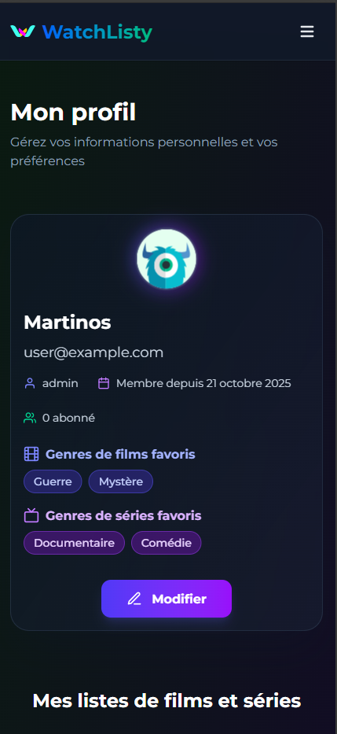
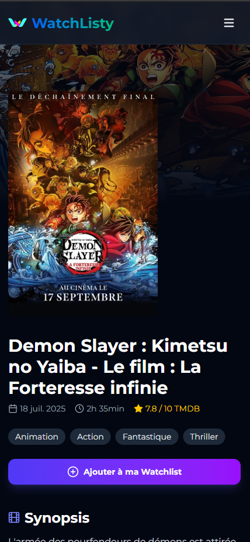
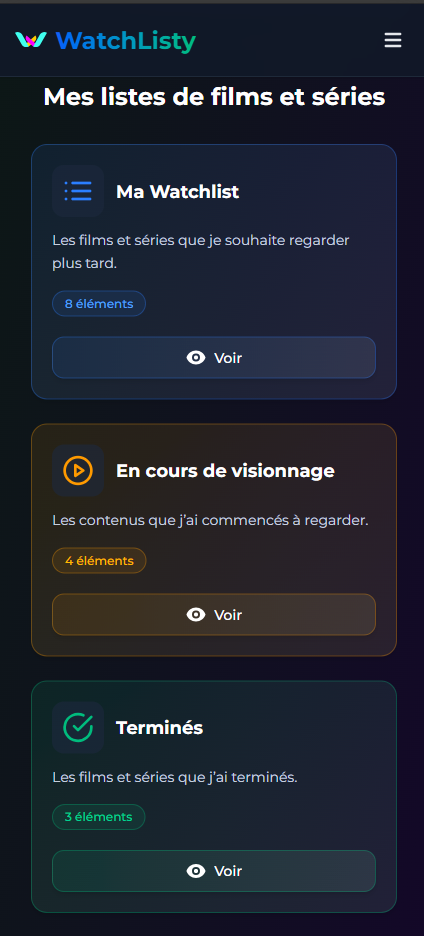
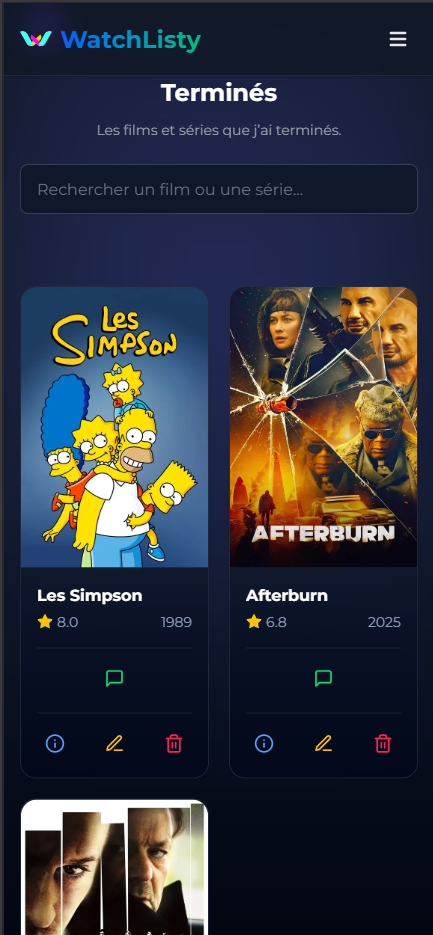

# 🎬 WatchListy

<div align="center">

<!-- **Tech Stack** -->
> *Powered by modern web technologies* ⚡


<!-- **Deployment** -->
> *Deployed with*


---

### **🌍 Découvrez WatchListy en ligne**
**[👉 Accéder à l'app](https://watch-listy-one.vercel.app/)**
*Ou scannez le QR code ci-dessous :*

<div align="center">

[](https://watch-listy-one.vercel.app/)


</div>

</div>

---


## 📚 Sommaire

- [🎬 WatchListy](#-watchlisty)
    - [**🌍 Découvrez WatchListy en ligne**](#-découvrez-watchlisty-en-ligne)
  - [📚 Sommaire](#-sommaire)
  - [📖 Introduction](#-introduction)
  - [🎬 Fonctionnalités](#-fonctionnalités)
    - [🧑‍💻 Gestion des utilisateurs](#-gestion-des-utilisateurs)
    - [🎥 Fonctionnalités principales](#-fonctionnalités-principales)
      - [🔹 Page Films](#-page-films)
      - [🔹 Page Séries](#-page-séries)
    - [🎞️ Page de détail (film ou série)](#️-page-de-détail-film-ou-série)
    - [📋 Gestion de la watchlist](#-gestion-de-la-watchlist)
    - [👥 Interactions sociales](#-interactions-sociales)
    - [🌍 Internationalisation](#-internationalisation)
    - [📲 PWA](#-pwa)
    - [⚙️ Gestion de l’état (Redux)](#️-gestion-de-létat-redux)
    - [🧠 Données externes et performance](#-données-externes-et-performance)
  - [🖼️ Prévisualisation](#️-prévisualisation)
  - [🧰 Stack Technique](#-stack-technique)
    - [🧩 Stack](#-stack)
    - [⚙️ State Management \& Architecture](#️-state-management--architecture)
    - [🎨 UI \& Animations](#-ui--animations)
    - [🔒 Authentification \& Sécurité](#-authentification--sécurité)
    - [🗄️ Backend \& Base de données](#️-backend--base-de-données)
    - [🌍 Internationalisation \& PWA](#-internationalisation--pwa)
    - [🎥 APIs Externes](#-apis-externes)
    - [🧪 Tests \& Qualité](#-tests--qualité)
    - [🛠️ Outils de développement](#️-outils-de-développement)
- [🚀 **WatchListy - Installation \& Configuration**](#-watchlisty---installation--configuration)
  - [📋 **Prérequis**](#-prérequis)
  - [**1) Cloner le projet**](#1-cloner-le-projet)
  - [**2) Installer les dépendances**](#2-installer-les-dépendances)
  - [**3) Configurer MongoDB Atlas**](#3-configurer-mongodb-atlas)
  - [**4) Configurer TMDB**](#4-configurer-tmdb)
  - [**5) Configurer BREVO**](#5-configurer-brevo)
  - [**6) Générer un `NEXTAUTH_SECRET` sécurisé**](#6-générer-un-nextauth_secret-sécurisé)
    - [**Avec OpenSSL (recommandé)**](#avec-openssl-recommandé)
  - [**7) Configurer `.env.local`**](#7-configurer-envlocal)
  - [**8) Lancer l'application**](#8-lancer-lapplication)
  - [**9) Injecter des données de test (Seed)**](#9-injecter-des-données-de-test-seed)
  - [**10) Lancer les tests (Playwright)**](#10-lancer-les-tests-playwright)
  - [**11) Build pour la production**](#11-build-pour-la-production)
  - [🔧 **Dépannage**](#-dépannage)
  - [🧱 Structure du projet](#-structure-du-projet)
    - [🧭 Aperçu rapide](#-aperçu-rapide)
  - [🌐 Liens utiles](#-liens-utiles)
  - [💙 Remerciements](#-remerciements)


## 📖 Introduction

**Watchlisty** est une application web moderne permettant de **gérer, explorer et partager vos films et séries** préférés.  
Elle s’adresse aux cinéphiles et sériephiles souhaitant **organiser leur watchlist**, **suivre leur progression** et **découvrir de nouvelles recommandations** grâce à l’intégration de l’API **[TMDB](https://www.themoviedb.org/)**.

L’objectif du projet est de proposer une expérience fluide, personnalisable et sociale autour du visionnage.

> 💡 *Watchlisty combine l’efficacité d’un gestionnaire personnel avec la dimension communautaire du partage et des recommandations.*

## 🎬 Fonctionnalités

### 🧑‍💻 Gestion des utilisateurs

* **Authentification complète avec NextAuth (JWT)** :
  * Connexion et inscription sécurisées.  
  * **Validation d’email** lors de l’inscription.  
  * **Renvoi d’email de validation** en cas de non-réception.  
  * **Réinitialisation du mot de passe** via email.  
  * **Édition du profil utilisateur** (pseudo, avatar, préférences, etc.).  
* **Gestion des utilisateurs côté backend** avec **MongoDB** et **Next.js API Routes** :
  * Création, mise à jour, suppression et récupération des profils.  

---

### 🎥 Fonctionnalités principales

#### 🔹 Page Films

* Affichage des **films populaires** par défaut.  
* **Recherche** par mot-clé pour retrouver un film précis.  
* **Filtres avancés** :
  * Genre  
  * Langue d’origine  
  * Note minimale  
  * Tri par :
    * Popularité (plus / moins populaire)  
    * Note (croissante / décroissante)  
    * Date de sortie (plus / moins récente)  
* **Ajout à la watchlist** directement depuis la fiche d’un film.  

#### 🔹 Page Séries

* Fonctionnalités équivalentes à la page Films :
  * Affichage des **séries populaires**.  
  * Recherche et filtres identiques.  
  * **Ajout à la watchlist** depuis la fiche d’une série.  

---

### 🎞️ Page de détail (film ou série)

Chaque fiche affiche des informations complètes :

* **Titre**, **synopsis**, **genre**, **durée** (ou nombre d’épisodes pour les séries).  
* **Note TMDB** et/ou **note moyenne des utilisateurs Watchlisty**.  
* **Bande-annonce intégrée** (si disponible).  
* **Affichage du casting principal**.  
* **Avis des utilisateurs de Watchlisty** (commentaires et notes).  
* **Section de recommandations** :
  * Films ou séries similaires / liés au contenu consulté.  

---

### 📋 Gestion de la watchlist

Accessible depuis le **profil utilisateur**, la watchlist est organisée en **trois catégories** :

1. **Ma Watchlist** – films et séries à regarder.  
2. **En cours de visionnage** – contenu en cours.  
3. **Terminés** – contenu déjà vu.  

Fonctionnalités :

* Changer l’état d’un film ou d’une série (à regarder ↔ en cours ↔ terminé).  
* Supprimer un élément de la watchlist.  
* Lorsqu’un contenu est **terminé** :
  * Possibilité d’**ajouter une note**.  
  * Possibilité de **laisser un commentaire**.  

---

### 👥 Interactions sociales

* Depuis le **profil**, possibilité d’**ajouter un autre utilisateur** via son pseudo.  
* Accès à leur **profil public** et à leur **watchlist**.  
* Possibilité de **liker** la watchlist d’un autre utilisateur.  
* **Page “Utilisateurs”** :
  * Liste de tous les utilisateurs, triée selon les **watchlists les plus aimées**.  
  * **Barre de recherche** pour trouver rapidement un utilisateur.  
  * Accès à leur profil public et possibilité de **s’abonner**.  

---

### 🌍 Internationalisation

* **Application multilingue** disponible en **français** 🇫🇷 et **anglais** 🇬🇧.  
* Détection automatique de la langue et possibilité de bascule manuelle.  

---

### 📲 PWA

* **PWA (Progressive Web App)** avec installation possible sur mobile et desktop.

---

### ⚙️ Gestion de l’état (Redux)

* **Centralisation** de toutes les données clés :
  * Informations utilisateur, préférences, authentification.  
  * Watchlist et états associés.  
* **Gestion fluide** des actions d’ajout, suppression, chargement et synchronisation backend/frontend.  

---

### 🧠 Données externes et performance

* **Intégration complète avec TMDB** :
  * Récupération des informations sur les films et séries (titres, synopsis, affiches, genres, etc.).  
  * Données de casting et recommandations.  
* **Gestion intelligente du cache** pour optimiser les appels API et améliorer les performances.  
* **Suivi des logs** avec **Pino** pour une meilleure traçabilité des erreurs et requêtes serveur.  

## 🖼️ Prévisualisation

Voici un aperçu de l'application WatchListy :

<div align="center">

<table>
  <tr>
    <td></td>
    <td></td>
  </tr>
  <tr>
    <td></td>
    <td></td>
  </tr>
</table>

</div>

---

## 🧰 Stack Technique

### 🧩 Stack

**Next.js 15.5.4** – Framework React moderne avec **App Router** pour un rendu hybride (**SSR / SSG / ISR**).  
**React 19.1.0** – Bibliothèque UI avec **Server Components** et gestion optimisée du rendu.  
**TypeScript 5.9.3** – Typage statique et DX améliorée pour un code plus robuste.  
**Tailwind CSS 4.1.14** – Framework CSS utilitaire moderne pour un design rapide et responsive.  


### ⚙️ State Management & Architecture

**Redux Toolkit 2.9.1** – Gestion d’état globale moderne et simplifiée.  
**React Redux 9.2.0** – Intégration transparente entre React et Redux.  
**Next Redux Wrapper 8.1.0** – Hydratation automatique serveur/client pour Next.js.  
**Zod 4.1.12** – Validation et typage runtime des données (formulaires, API, etc.).  
**React Hot Toast** – Notifications légères et réactives pour une meilleure UX.  

---

### 🎨 UI & Animations

**Framer Motion 12.23.22** – Animations fluides et transitions avancées.  
**React Icons 5.5.0** – Large collection d’icônes vectorielles.  
**Tailwind CSS** – Utilisé pour la mise en page, les effets visuels et la réactivité et le responsive.  

---

### 🔒 Authentification & Sécurité

**NextAuth.js 4.24.11** – Authentification complète via **JWT** et **MongoDB Adapter** :  
- Validation d’email, renvoi de lien, réinitialisation du mot de passe.  
- Gestion sécurisée des sessions et cookies.  

**BcryptJS 3.0.2** – Hashage sécurisé des mots de passe côté serveur.  
**Dotenv 17.2.3** – Gestion centralisée des variables d’environnement.  

---

### 🗄️ Backend & Base de données

**MongoDB 5.9.2** – Base de données NoSQL hébergée (MongoDB Atlas).  
**Next.js API Routes** – Endpoints serveur intégrés pour la gestion des utilisateurs, watchlists, etc.  
**Pino + Pino Pretty** – Logging performant et lisible côté serveur.  

---

### 🌍 Internationalisation & PWA

**Next-Intl 4.4.0** – Internationalisation complète (**Français 🇫🇷 / Anglais 🇬🇧**).  
**Next-PWA 5.6.0** – Génération automatique du service worker.

---

### 🎥 APIs Externes

**TMDB API** – Source principale des données (films, séries, genres, castings, recommandations).  
**@getbrevo/brevo** – Envoi d’emails transactionnels (validation, mot de passe oublié).  

---

### 🧪 Tests & Qualité

**Playwright 1.56.1** + **@playwright/test** – Tests end-to-end automatisés.  
**TypeScript + ts-node** – Support pour les scripts backend et le **seeding typé**.  

---

### 🛠️ Outils de développement

**Git** – Contrôle de version.  
**PostCSS + Autoprefixer** – Optimisation et compatibilité CSS.  
**Scripts personnalisés** (`seed:users`) – Injection de données utilisateurs dans la base MongoDB (test / démo).  

---


# 🚀 **WatchListy - Installation & Configuration**

Ce guide explique comment installer et exécuter **WatchListy** en local, configurer **MongoDB Atlas**, **NextAuth.js**, et lancer les scripts de développement.

---

## 📋 **Prérequis**
- Node.js (v18+)
- npm / yarn / pnpm
- Un compte [MongoDB Atlas](https://cloud.mongodb.com/)
- Un compte [TMDB](https://www.themoviedb.org/) (pour l'API films)
- Un compte [Brevo](https://www.brevo.com/) (pour l'envoi d'emails)

---

## **1) Cloner le projet**
```bash
git clone https://github.com/Mart1n-S/WatchListy.git
cd watchlisty
```

---

## **2) Installer les dépendances**
```bash
npm install
# ou
yarn install
# ou
pnpm install
```

---

## **3) Configurer MongoDB Atlas**
1. Créez un compte gratuit sur [MongoDB Atlas](https://cloud.mongodb.com/).
2. Créez un **cluster gratuit** (choisissez `M0`).
3. Ajoutez votre **IP actuelle** dans la section *Network Access*.
4. Créez un utilisateur avec des droits *Read/Write*.
5. Copiez votre **URI de connexion** (format : `mongodb+srv://<user>:<password>@cluster.mongodb.net`).

## **4) Configurer TMDB**
1. Créez un compte gratuit sur [TMDB](https://www.themoviedb.org/).
2. Allez dans la section *API* et créez une nouvelle clé API.
3. Copiez votre **clé API**.

## **5) Configurer BREVO**
1. Créez un compte gratuit sur [Brevo](https://www.brevo.com/).
2. Allez dans la section *API* et créez une nouvelle clé API.
3. Copiez votre **clé API**.


---

## **6) Générer un `NEXTAUTH_SECRET` sécurisé**
NextAuth.js nécessite une clé secrète pour signer les tokens JWT.
Pour en générer une **sécurisée** (32+ caractères) :

### **Avec OpenSSL (recommandé)**
```bash
openssl rand -base64 32
```
Copiez la sortie dans `.env.local`.


---

## **7) Configurer `.env.local`**
Dupliquez `.env.example` en `.env.local` et complétez :

```bash
# MongoDB
MONGODB_URI=mongodb+srv://<user>:<password>@cluster.mongodb.net/<dbname>?retryWrites=true&w=majority
MONGODB_DATABASE=<votre_dbname>

# NextAuth
NEXTAUTH_SECRET=<votre_secret_généré>
NEXTAUTH_URL="http://localhost:3000"

# TMDB API (pour les films/séries)
TMDB_API_BASE=https://api.themoviedb.org/3
TMDB_ACCESS_TOKEN=<votre_token_tmdb>

# Email (Brevo)
BREVO_API_KEY=<votre_clé_brevo>
# Email de votre compte Brevo
BREVO_EMAIL_ADDRESS=

# Autres
NEXT_PUBLIC_SITE_URL=http://localhost:3000
# Adresse email utilisée pour les communications de contact
CONTACT_EMAIL=

# Clé de vérification Google pour la Search Console (pas obligatoire utiliser pour la prod pour le SEO)
NEXT_PUBLIC_GOOGLE_SITE_VERIFICATION=
```

---

## **8) Lancer l'application**
```bash
npm run dev
```
Accédez à [http://localhost:3000](http://localhost:3000).

---

## **9) Injecter des données de test (Seed)**
Pour créer des utilisateurs et films de test :
```bash
npm run seed:users
```

---

## **10) Lancer les tests (Playwright)**
```bash
npx playwright test

# ou en mode UI
npx playwright test --ui

# pour voir le rapport
npx playwright show-report
```

---

## **11) Build pour la production**
```bash
npm run build
npm start
```

---

## 🔧 **Dépannage**
| Problème                    | Solution                                             |
| --------------------------- | ---------------------------------------------------- |
| Erreur de connexion MongoDB | Vérifiez `MONGODB_URI` et l'IP autorisée dans Atlas. |
| Erreur NextAuth             | Vérifiez `NEXTAUTH_SECRET` et `NEXTAUTH_URL`.        |
| API TMDB non accessible     | Vérifiez `TMDB_ACCESS_TOKEN`.                        |


## 🧱 Structure du projet

Voici une synthèse de la structure des dossiers et fichiers principaux du projet **WatchListy** :

```
📦 WatchListy
├── .github/          → Images pour le README
├── public/           → Fichiers statiques (favicon, manifest, images)
├── scripts/          → Scripts utilitaires (ex: seed de la base)
├── src/
│   ├── app/          → Pages Next.js et routes API (auth, users, TMDB…)
│   ├── components/   → Composants UI (auth, profil, médias, layout…)
│   ├── hooks/        → Hooks personnalisés
│   ├── i18n/         → Configuration de la traduction (Next Intl)
│   ├── lib/          → Logique métier (auth, Redux, DB, validation…)
│   ├── models/       → Modèles Mongoose (User, Review, Watchlist)
│   ├── types/        → Types et interfaces TypeScript
│   └── middleware.ts → Middleware Next.js (auth et i18n)
├── tests/            → Tests E2E Playwright
├── .env.example      → Variables d’environnement (exemple)
├── next.config.ts    → Configuration Next.js
├── playwright.config.ts → Configuration des tests
├── tsconfig.json     → Configuration TypeScript
└── package.json      → Dépendances et scripts du projet
```

---

### 🧭 Aperçu rapide

* **`src/app/`** → Structure des pages et routes API.
* **`src/components/`** → Interface utilisateur (UI) organisée par modules.
* **`src/lib/`** → Logique applicative : auth, Redux, validation, MongoDB.
* **`tests/`** → Scénarios end-to-end avec Playwright.
* **`public/`** → Ressources statiques accessibles depuis le web.


## 🌐 Liens utiles

* [TMDB API](https://developers.themoviedb.org/3)
* [Brevo API](https://developers.brevo.com/docs/getting-started)
* [Next.js Documentation](https://nextjs.org/docs)
* [Tailwind CSS](https://tailwindcss.com/docs)
* [Redux Toolkit](https://redux-toolkit.js.org/)
* [Next-Intl](https://next-intl-docs.vercel.app/)
* [Playwright Documentation](https://playwright.dev/docs/intro)

---

## 💙 Remerciements

Ce projet a été conçu avec passion par **[Mart1n-S](https://github.com/Mart1n-S)**.
Les données proviennent de [TMDB](https://www.themoviedb.org/), mais WatchListy n’est **ni affilié ni certifié** par TMDB.

---
